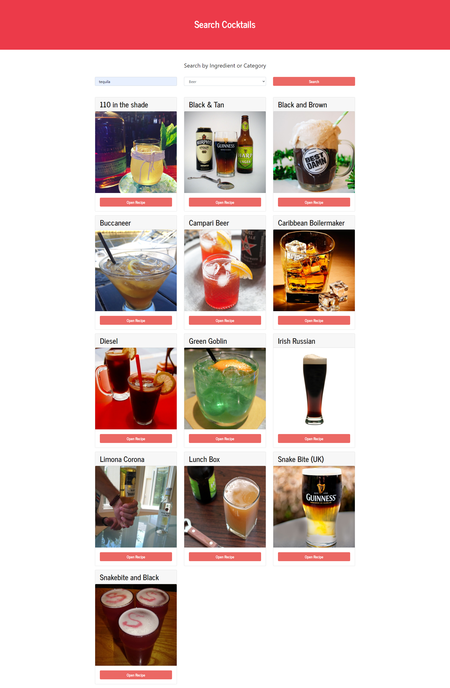
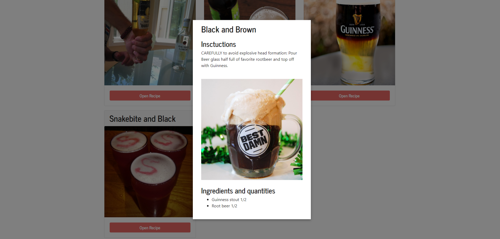

<p align="center">

</p>

# search-cocktails
* [Search Cocktail Web](https://danisan9490.github.io/search-cocktails/)

## Built With

* [React](https://reactjs.org/)
* [React Hooks](https://reactjs.org/docs/hooks-intro.html)
* [Emotion](https://emotion.sh/)


## Getting Started

### Prerequisites

For this project you need:

```
Nodejs
```

### Installing

Go to search-cocktail/client and run:

```
npm install
```


## Running React

In the same folder run:

```
npm start
```

Now you can use the App!


## Result

### Home


### Cocktail



